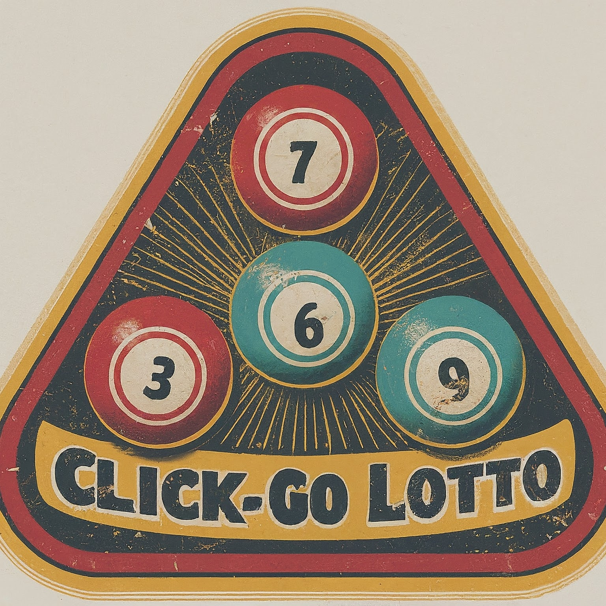

# Click-Go-Lotto

Get lottery numbers for Cash3, Cash4, Cash4Life, Fantasy Five, Mega Millions, Pick3, Pick4, Pick5, and Powerball with a
click of a button.

## Description

This web applications uses the Bootstrap on the Front-End and Python/Flask on the Back-End to display the website and
provide the random lottery numbers. Visitors can get a new set of numbers for a specific game by clicking on the button.

## Getting Started

### Dependencies

* A modern web browser (like Google Chrome) with JavaScript enabled.

## Website

[clickgolotto.com](https://clickgolotto.com/)

## Help

* Please file a new issue using the [Issues](https://github.com/brittbot-bgates/Click-Go-Lotto/issues) tab on the
  repo.

## Author

* Brittany Gates
    * [Website](https://brittbot.com)
    * [Email](mailto:support@brittbot.com)
    * [LinkedIn](https://www.linkedin.com/in/brittanycgates/)
    * [Twitter / X](https://x.com/brittany__gates)
    * [YouTube](https://www.youtube.com/c/BrittanyGates)

## Version History

* v2.1 release
    * Consolidated all the individual modules for each game into one module.
    * Added type annotations to all the functions and variables.
    * Added a gitignore file.
    * Fixed typos.
* Pre-v2.1 release
    * Completed the redesign of the website, and uploaded it to Google Cloud for deployment.
    * Completed the desktop version CSS for the entire site. Also, the app works properly now. However, it will not
      resize properly for mobile devices because I haven't completed the CSS for those devices yet.
    * I'm currently creating "Build v2" of the app to improve the layout and design. Plus, I added another lottery game.
      The changes aren't live on the website yet.

## Acknowledgments

* [Dominique Pizzie](https://gist.github.com/DomPizzie) for the simple README template

