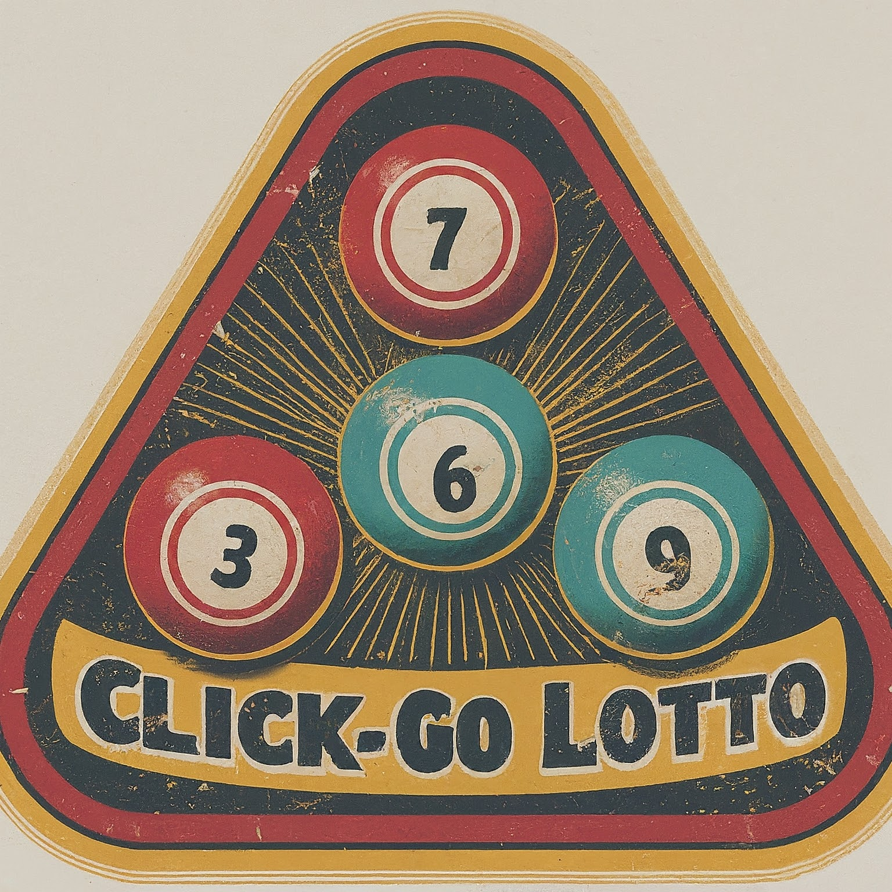

# Click-Go-Lotto

Get lottery numbers for Cash3, Cash4, Cash4Life, Fantasy Five, Mega Millions, Pick3, Pick4, Pick5, and Powerball with a
click of a button.

## About The Program

This web applications uses the Bootstrap on the Front-End and Python/Flask on the Back-End to display the website and
provide the random lottery numbers. Visitors can get a new set of numbers for a specific game by clicking on the button.

## Program Dependencies

A modern web browser (like Google Chrome) with JavaScript enabled.

## Website

[clickgolotto.com](https://clickgolotto.com/)

## Found A Bug? Need Help?

Please file a new issue using the [Issues](https://github.com/brittbot-bgates/Click-Go-Lotto/issues) tab on the repo.

## Version History

* Latest release notes as of March 2025:
    * Created a base.html template
    * Extended the base.html template to all the html files in the project.
* Latest release notes as of February 2025:
    * Updated the README.
* Latest release notes as of January 2025:
    * Updated the footer on all pages to display all my social media links.
* Latest release notes as of late December 2024:
    * Consolidated all the individual modules for each game into one module.
    * Added type annotations to all the functions and variables.
    * Added a gitignore file.
    * Updated the social media links in the index.html footer.
    * Fixed typos.
    * Removed unnecessary files from the repo.

## License

This project is licensed under the MIT License. See the LICENSE file for details.

## Acknowledgments

[Dominique Pizzie](https://gist.github.com/DomPizzie) for the simple README template.

